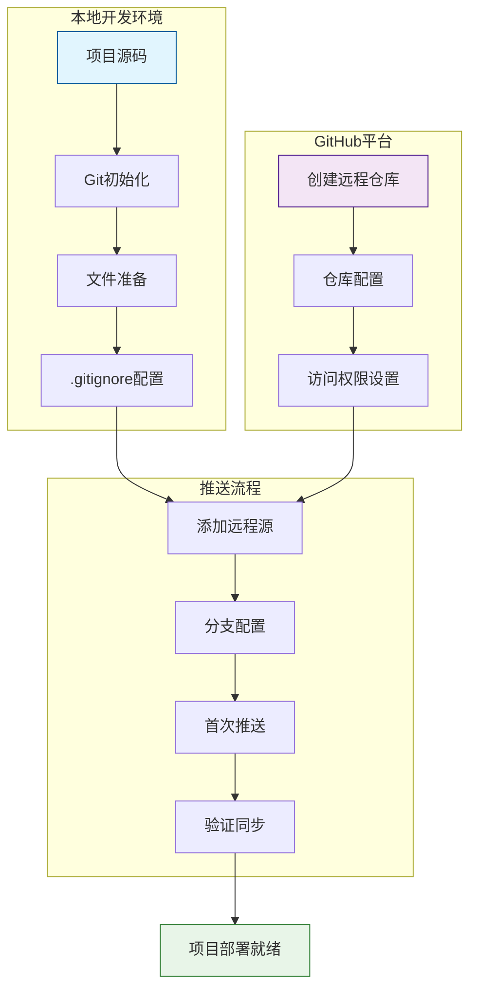
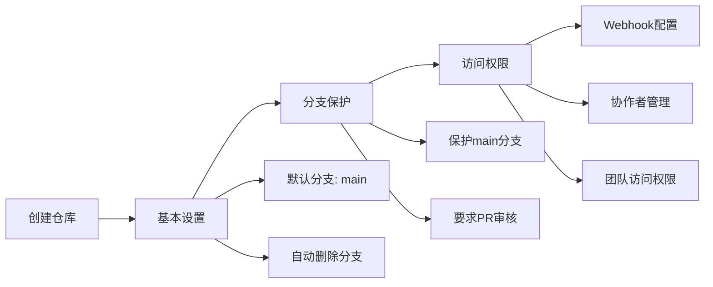
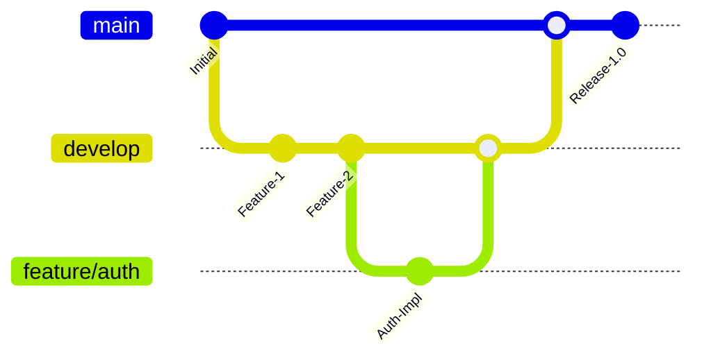

# Max Flutter App GitHub上传设计文档

## 概述

本文档详细描述了将Max Flutter App项目上传到GitHub仓库的完整流程，包括项目准备、仓库创建、Git配置、文件优化和推送等关键步骤。

## 项目背景

Max Flutter App是一个基于Flutter 3.35.3框架的跨平台源码分享社区应用，支持Android、iOS和Web平台。项目采用MVVM + Repository架构模式，使用Provider进行状态管理，具有完整的用户认证、社区论坛、消息系统等功能模块。

## 技术特征

- **核心框架**: Flutter 3.35.3 + Dart 3.9.2+
- **状态管理**: Provider模式
- **网络层**: Dio + HTTP请求拦截器
- **本地存储**: SharedPreferences
- **UI组件**: Material Design + 自定义组件库
- **构建工具**: build_runner + json_serializable

## GitHub上传架构



## 前置准备工作

### 1. 环境检查
确保开发环境满足以下要求：

| 工具 | 版本要求 | 验证命令 |
|------|----------|----------|
| Git | >= 2.30.0 | `git --version` |
| Flutter | >= 3.0.0 | `flutter --version` |
| Dart | >= 3.0.0 | `dart --version` |

### 2. 项目文件清理
在上传前需要清理以下临时文件：

```
删除目录:
├── build/              # 构建输出目录
├── .dart_tool/         # Dart工具缓存
├── android/.gradle/    # Android Gradle缓存
├── ios/Pods/          # iOS CocoaPods依赖
└── web/build/         # Web构建缓存

保留文件:
├── .gitignore         # Git忽略规则
├── pubspec.yaml       # 项目配置
├── README.md          # 项目说明
├── lib/              # 核心源码
├── android/          # Android平台配置
├── ios/              # iOS平台配置
└── web/              # Web平台配置
```

### 3. .gitignore文件配置
确保项目根目录包含完整的`.gitignore`文件：

```gitignore
# Flutter相关
.dart_tool/
.packages
.metadata
.flutter-plugins
.flutter-plugins-dependencies
build/

# IDE相关
.idea/
.vscode/
*.swp
*.swo
*~

# Android相关
android/.gradle/
android/gradle/
android/gradlew
android/gradlew.bat
android/local.properties
android/app/debug/
android/app/profile/
android/app/release/

# iOS相关
ios/Pods/
ios/Runner.xcworkspace/xcuserdata/
ios/Runner.xcodeproj/xcuserdata/
ios/.symlinks/

# Web相关
web/build/

# 系统文件
.DS_Store
Thumbs.db

# 日志文件
*.log

# 环境变量
.env
.env.local
.env.*.local
```

## GitHub仓库创建

### 1. 仓库基本信息配置

| 配置项 | 推荐值 | 说明 |
|--------|--------|------|
| 仓库名称 | max-flutter-app | 项目标识符 |
| 描述 | 基于Flutter的跨平台源码分享社区应用 | 项目简介 |
| 可见性 | Public/Private | 根据需求选择 |
| 初始化README | 否 | 使用现有README.md |
| .gitignore | 否 | 使用现有配置 |
| 许可证 | MIT | 开源友好许可证 |

### 2. 仓库设置优化



## Git配置与推送

### 1. 本地Git初始化
在项目根目录执行以下命令：

```bash
# 初始化Git仓库
git init

# 配置用户信息（如果未全局配置）
git config user.name "Your Name"
git config user.email "your.email@example.com"

# 设置默认分支名
git config init.defaultBranch main
```

### 2. 文件暂存与提交
```bash
# 添加所有文件到暂存区
git add .

# 查看暂存状态
git status

# 创建初始提交
git commit -m "feat: 初始化Max Flutter App项目

- 完整的Flutter跨平台应用架构
- 实现用户认证、社区论坛、消息系统
- 支持Android、iOS、Web三端
- 使用Provider状态管理和Dio网络请求
- 包含完整的UI组件库和工具类"
```

### 3. 远程仓库关联
```bash
# 添加远程仓库（替换为实际的GitHub仓库地址）
git remote add origin https://github.com/[YOUR_USERNAME]/max-flutter-app.git

# 验证远程仓库配置
git remote -v

# 设置上游分支并推送
git push -u origin main
```

### 4. 推送验证
```bash
# 检查推送状态
git log --oneline -5

# 验证远程分支
git branch -a

# 检查远程仓库状态
git remote show origin
```

## 项目文档完善

### 1. README.md优化
确保README.md包含以下关键信息：

```markdown
# Max Flutter App

## 🎯 项目亮点
- 跨平台架构（Android + iOS + Web）
- 完整的用户认证系统
- 实时社区论坛功能
- 现代化UI设计（主色调#FF6900）

## 🏗️ 架构特性
- MVVM + Repository模式
- Provider状态管理
- Dio网络请求拦截器
- 模块化组件设计

## 🚀 快速体验
```bash
git clone https://github.com/[USERNAME]/max-flutter-app.git
cd max-flutter-app
flutter pub get
flutter run -d chrome  # Web版本
```

### 2. 补充技术文档
创建以下文档文件：

| 文档文件 | 用途 | 位置 |
|----------|------|------|
| CONTRIBUTING.md | 贡献指南 | 根目录 |
| CHANGELOG.md | 版本更新日志 | 根目录 |
| docs/API.md | API接口文档 | docs目录 |
| docs/ARCHITECTURE.md | 架构设计文档 | docs目录 |

## 分支管理策略

### 1. 分支结构设计


### 2. 分支保护规则
- **main分支**: 生产环境代码，需要PR审核
- **develop分支**: 开发集成分支，测试通过后合并到main
- **feature/***: 功能开发分支，完成后合并到develop
- **hotfix/***: 紧急修复分支，直接从main分支出，修复后合并回main和develop

## 协作开发配置

### 1. Issue模板配置
在`.github/ISSUE_TEMPLATE/`目录创建以下模板：

- `bug_report.md`: Bug报告模板
- `feature_request.md`: 功能请求模板
- `question.md`: 问题咨询模板

### 2. Pull Request模板
创建`.github/pull_request_template.md`：

```markdown
## 变更类型
- [ ] Bug修复
- [ ] 新功能
- [ ] 性能优化
- [ ] 文档更新

## 变更描述
简要描述本次PR的主要变更内容

## 测试情况
- [ ] 单元测试通过
- [ ] 集成测试通过
- [ ] 手动测试验证

## 影响范围
说明变更可能影响的功能模块
```

## CI/CD集成准备

### 1. GitHub Actions工作流
在`.github/workflows/`目录配置自动化流程：

```yaml
# ci.yml - 持续集成
name: CI
on: [push, pull_request]
jobs:
  test:
    runs-on: ubuntu-latest
    steps:
      - uses: actions/checkout@v3
      - uses: subosito/flutter-action@v2
        with:
          flutter-version: '3.35.3'
      - run: flutter pub get
      - run: flutter analyze
      - run: flutter test
```

### 2. 构建部署配置
```yaml
# deploy.yml - 自动部署
name: Deploy
on:
  push:
    branches: [main]
jobs:
  build-web:
    runs-on: ubuntu-latest
    steps:
      - uses: actions/checkout@v3
      - uses: subosito/flutter-action@v2
      - run: flutter build web --release
      - uses: peaceiris/actions-gh-pages@v3
        with:
          github_token: ${{ secrets.GITHUB_TOKEN }}
          publish_dir: ./build/web
```

## 安全与权限管理

### 1. 敏感信息处理
确保以下敏感信息不被提交：
- API密钥和访问令牌
- 数据库连接字符串
- 第三方服务凭证
- 用户隐私数据

### 2. 仓库安全设置
- 启用漏洞扫描
- 配置依赖项安全检查
- 设置分支保护规则
- 限制强制推送权限

## 推送后验证清单

### 1. 功能验证
- [ ] 仓库可正常访问
- [ ] README.md正确显示
- [ ] 目录结构完整
- [ ] 代码语法高亮正常

### 2. 配置验证
- [ ] 分支保护规则生效
- [ ] CI/CD工作流触发正常
- [ ] Issue和PR模板加载
- [ ] 协作者权限正确

### 3. 文档验证
- [ ] 项目描述准确完整
- [ ] 安装指南可执行
- [ ] API文档链接有效
- [ ] 贡献指南清晰

## 维护与更新策略

### 1. 定期维护任务
- **每周**: 检查依赖项更新
- **每月**: 更新Flutter SDK版本
- **每季度**: 安全漏洞扫描
- **每半年**: 架构设计审查

### 2. 版本发布流程
1. 功能开发完成
2. 代码审查通过
3. 测试用例验证
4. 版本标签创建
5. Release Notes发布
6. 社区通知更新

## 备份与恢复

### 1. 数据备份策略
- **代码备份**: GitHub自动备份
- **配置备份**: 导出仓库设置
- **文档备份**: 定期本地同步
- **Issue备份**: 使用GitHub API导出

### 2. 恢复预案
在发生数据丢失或误操作时的恢复步骤：
1. 从GitHub恢复最新代码
2. 重新配置本地开发环境
3. 恢复分支和标签信息
4. 验证项目完整性